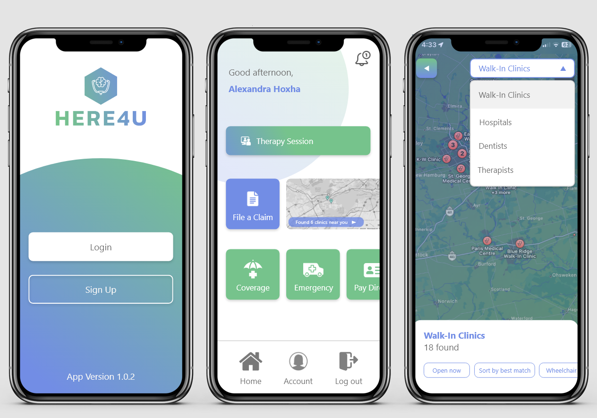
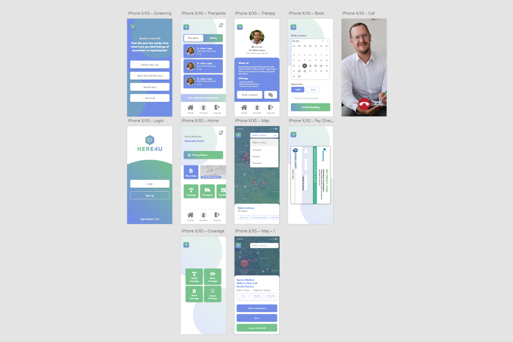

# HERE4U
This project that was done for the Seneca May 2023 Hackathon. Me and my partner <a href="https://github.com/Sunraj751">Sunraj Sharma</a> worked on the category "Student Experince" and developed a proof of concept app for online therapy targeted towards students that uses their school funded insurance. It also works as a portal or hub for to monitor and track your school insurance coverage (dental, health, ect.)
 
</img>
</img>
</img>
  

## Want to see full quality mockups?
To view the full quality of the app mockup screens, you can head to UI>screens.pdf , or you can <a href="https://github.com/bburton0334/here4u/blob/7b73324cbef4d963cbe9d3e88e97db9280c407b1/UI/screens.pdf">click here to view them</a>.
